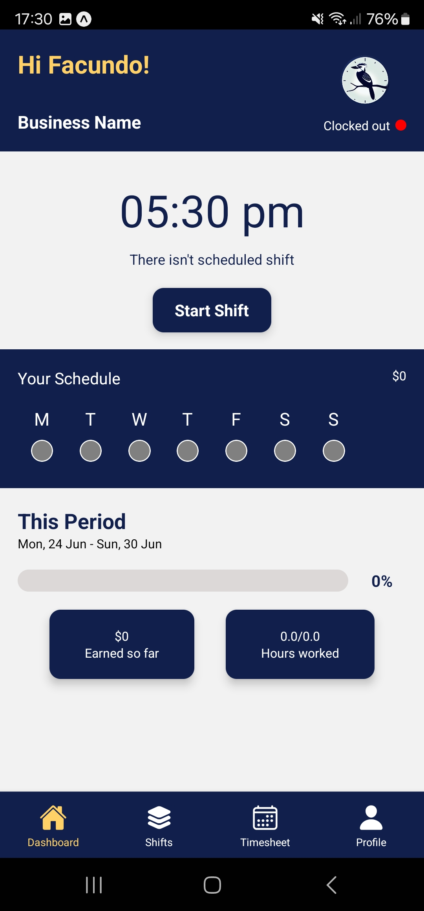

# Clockaburra Mobile

<p align="center">
  
  
  
</p>

Mobile application for the Clockaburra employee management platform.

Clockaburra Mobile extends the Clockaburra ecosystem by providing employees with a native mobile experience. The application communicates with the same REST API as the web platform, allowing users to manage attendance, review work schedules and access their personal information from anywhere.

Built with **React Native**, **Redux Toolkit**, **React Navigation** and **Firebase Authentication**.

## Features

- 📱 Native mobile experience.
- 🔐 Secure authentication with Firebase Authentication.
- ⏱️ Employee clock in / clock out.
- 📅 Shift schedule visualization.
- 👤 Employee profile management.
- 📊 Attendance history.
- 🔄 Integration with the Clockaburra REST API.

- ## Tech Stack

| Category | Technologies |
|----------|--------------|
| **Framework** | React Native · Expo |
| **State Management** | Redux Toolkit · React Redux |
| **Navigation** | React Navigation |
| **Authentication** | Firebase Authentication |
| **Networking** | Axios |
| **Date & Time** | Luxon |
| **UI Components** | Expo Vector Icons |

- ## Architecture

### Feature-Based Component Architecture

The application is organized around reusable components, feature-specific modules and centralized state management.

Business logic, navigation, API communication and reusable UI components are kept separated to improve maintainability and make future features easier to implement.

### Design Decisions

Some of the architectural decisions implemented in this project include:

- Feature-oriented component organization.
- Global state management with Redux Toolkit.
- Navigation separated from business logic.
- Custom hooks for reusable application logic.
- Shared REST API with the web application.
- Reusable UI components.

### Project Structure

```text
Clockaburra-App
│
├── assets/
│
├── src
│   ├── components/
│   │   ├── dashboard/
│   │   ├── profile/
│   │   ├── shifts/
│   │   └── ui/
│   ├── constants/
│   ├── data/
│   ├── helpers/
│   ├── hooks/
│   ├── models/
│   ├── navigation/
│   ├── screens/
│   ├── store/
│   │   ├── reducers/
│   │   └── store.js
│   ├── App.js
│   └── ...
│
├── package.json
└── README.md
```

### Folder Overview

| Folder | Responsibility |
|---------|----------------|
| **components** | Reusable UI components organized by feature. |
| **screens** | Main application screens. |
| **navigation** | Navigation configuration using React Navigation. |
| **store** | Redux Toolkit store and reducers. |
| **hooks** | Custom hooks containing reusable business logic. |
| **helpers** | Utility functions used throughout the application. |
| **models** | Domain models. |
| **constants** | Shared application constants. |
| **assets** | Images, fonts and static resources. |

## Custom Hooks

The project uses custom React hooks to encapsulate reusable business logic and keep UI components focused on presentation.

This approach improves code organization, encourages reuse and simplifies component maintenance.

## State Management

Global application state is managed using **Redux Toolkit**.

The application separates each domain into independent slices, allowing different features to share a centralized store while remaining loosely coupled.

This approach keeps state predictable, simplifies updates and makes the application easier to maintain as new features are introduced.

## API Integration

The mobile application communicates with the Clockaburra REST API through a dedicated service layer.

By isolating API communication from UI components, the application remains easier to maintain, test and extend while sharing the same backend used by the web platform.

This architecture allows both clients to consume the same business logic without duplicating backend functionality.

## Authentication

Authentication is handled using **Firebase Authentication**.

Only authenticated users can access the application's private features. After authentication, secure requests are performed against the REST API using JWT-based authorization.

This approach keeps authentication centralized while allowing both the web and mobile applications to share the same backend security model.

## Getting Started

### Requirements

Before running the project, make sure you have the following installed:

- Node.js 20+
- npm
- Expo CLI
- Expo Go (optional, for testing on a physical device)
- Clockaburra REST API running
- Firebase project configured

---

### Installation

Clone the repository and install the dependencies.

```bash
git clone https://github.com/FacundoVillarroel/Clockaburra-App.git

cd Clockaburra-App

npm install
```

---

### Environment Variables

Create a `.env` file and configure the required environment variables.

Example:

```env
EXPO_PUBLIC_API_URL=http://localhost:8080
EXPO_PUBLIC_FIREBASE_API_KEY=AIzaSyExampleApiKey123456789
EXPO_PUBLIC_FIREBASE_AUTH_DOMAIN=example-dev.firebaseapp.com
EXPO_PUBLIC_FIREBASE_PROJECT_ID=example-dev
EXPO_PUBLIC_FIREBASE_STORAGE_BUCKET=example-dev.appspot.com
EXPO_PUBLIC_FIREBASE_MESSAGING_SENDER_ID=123456789012
EXPO_PUBLIC_FIREBASE_APP_ID=1:123456789012:web:abcdef123456789
```

> **Note:** The complete list of environment variables depends on your Firebase configuration.

---

### Running the Application

Start the development server.

```bash
npm start
```

Then open the application using:

- Expo Go
- Android Emulator
- iOS Simulator

- ## Why I Built This Project

Clockaburra Mobile was created to extend the Clockaburra ecosystem beyond the web platform and explore how the same backend can support multiple client applications.

Instead of developing an isolated mobile application, the goal was to reuse the existing REST API and business logic while providing a native experience for employees.

Building this project helped me better understand mobile application architecture, state management, navigation and the challenges of maintaining consistency across multiple platforms that share the same backend.

Like the rest of the Clockaburra ecosystem, this project was developed with maintainability, scalability and code organization as primary goals rather than simply implementing features.

## Related Projects

- **[Clockaburra REST API](https://github.com/FacundoVillarroel/Clockaburra-RESTful-API)** → Backend REST API powering the platform.

- **[Clockaburra Web](https://github.com/FacundoVillarroel/Clockaburra-Web)** → Web application for administrators and managers.

- **[Clockaburra Mobile](https://github.com/FacundoVillarroel/Clockaburra-App)** → Native mobile application for employees.

- ## Author

**Facundo Villarroel**

Full Stack Software Development with a strong interest in software architecture and scalable backend systems.
- GitHub: https://github.com/FacundoVillarroel
- LinkedIn: https://www.linkedin.com/in/villarroelfacundo/

---

## License

This project is licensed under the MIT License.
